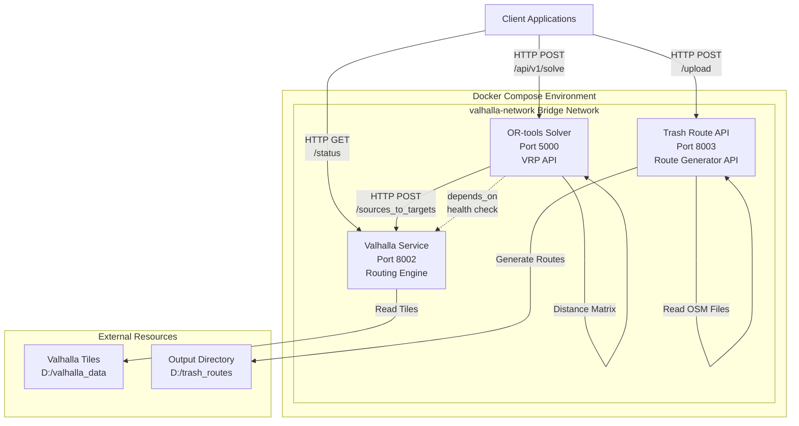
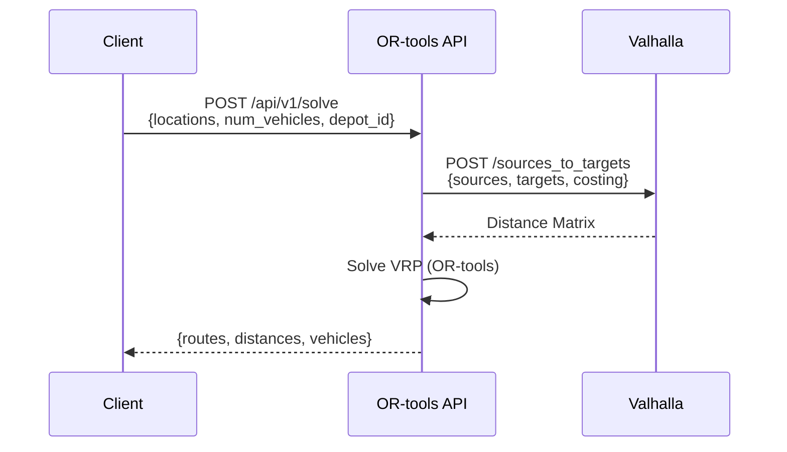
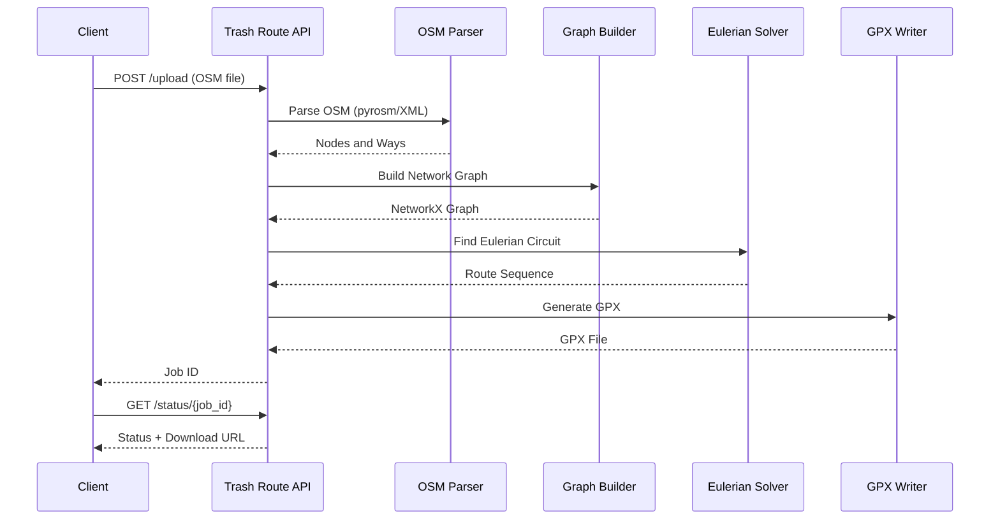

# System Architecture

## Overview

This system integrates Valhalla routing engine, OR-tools VRP solver, and a trash collection route generator to provide optimized routing solutions.

## Architecture Diagram



## Component Details

### 1. Valhalla Routing Engine

**Service**: `valhalla`  
**Port**: 8002  
**Image**: `ghcr.io/valhalla/valhalla:latest`  
**Purpose**: Provides routing and distance matrix calculations

**Key Features**:
- Routing between locations
- Distance/time matrix generation
- Multiple routing profiles (driving, walking, cycling)
- Isochrone generation

**Volume Mounts**:
- `D:/valhalla_data:/custom_files` - Map tiles
- `./config:/custom_files/config:ro` - Configuration

**Health Check**: `GET /status`

### 2. OR-tools VRP Solver

**Service**: `or-tools-solver`  
**Port**: 5000  
**Build**: `./or-tools/Dockerfile`  
**Purpose**: Solves Vehicle Routing Problems using OR-tools

**Key Features**:
- VRP optimization with multiple vehicles
- Distance matrix from Valhalla
- Route optimization algorithms
- REST API for solving VRP

**API Endpoints**:
- `GET /health` - Health check
- `GET /` - Service info
- `POST /api/v1/solve` - Solve VRP problem

**Dependencies**:
- Depends on Valhalla (waits for health check)
- Uses Valhalla for distance matrix via `http://valhalla:8002`

### 3. Trash Route Generator API

**Service**: `trash-route-api`  
**Port**: 8003  
**Build**: `backend/trash-route-api/Dockerfile`  
**Purpose**: Generates optimized trash collection routes from OSM data

**Key Features**:
- OSM file parsing (XML and PBF via pyrosm)
- Road network extraction
- Eulerian circuit generation
- GPX route output
- Turn optimization

**API Endpoints**:
- `GET /health` - Health check
- `POST /upload` - Upload OSM file
- `POST /generate` - Generate route
- `GET /status/{job_id}` - Get job status
- `GET /download/{job_id}` - Download results

**Processing Pipeline**:
1. OSM Parser (pyrosm for PBF, XML parser for XML)
2. Graph Builder (NetworkX)
3. Component Analyzer
4. Eulerian Solver
5. Turn Optimizer
6. GPX Writer

## Data Flow

### VRP Solving Flow



**Steps**:
1. Client sends location list with vehicle count and depot
2. OR-tools requests distance matrix from Valhalla
3. Valhalla calculates distances/times between all locations
4. OR-tools solves VRP optimization problem
5. OR-tools returns optimized routes with vehicle assignments

### Trash Route Generation Flow



**Steps**:
1. Client uploads OSM file (XML or PBF)
2. OSM Parser extracts road network (pyrosm for PBF, XML parser for XML)
3. Graph Builder creates NetworkX graph from road segments
4. Component Analyzer identifies connected components
5. Eulerian Solver finds optimal route covering all edges
6. Turn Optimizer minimizes left turns
7. GPX Writer generates output file
8. Client downloads results

## Technology Stack

### Routing & Optimization
- **Valhalla**: C++ routing engine for distance/time calculations
- **OR-tools**: Google's optimization library for VRP solving
- **NetworkX**: Python graph library for network operations

### Data Processing
- **Pyrosm**: Fast PBF parsing (Cython-based, 2-4x faster than pyosmium)
- **Geopandas**: GeoDataFrame operations (dependency of pyrosm)
- **GPXpy**: GPX file generation

### APIs & Services
- **FastAPI**: Modern Python web framework for REST APIs
- **Uvicorn**: ASGI server for FastAPI
- **WebSockets**: Real-time progress updates

### Infrastructure
- **Docker**: Containerization
- **Docker Compose**: Service orchestration
- **Bridge Network**: Internal service communication

## Network Architecture

All services communicate via the `valhalla-network` bridge network:

```
valhalla-network (bridge)
├── valhalla (8002)
├── or-tools-solver (5000) → depends on valhalla
└── trash-route-api (8003)
```

**Service Discovery**:
- Services use Docker service names (e.g., `http://valhalla:8002`)
- Port mapping exposes services to host machine
- Internal communication stays within Docker network

**Dependencies**:
- OR-tools waits for Valhalla health check before starting
- OR-tools queries Valhalla for distance matrices
- All services are independent except OR-tools → Valhalla dependency

## Storage Architecture

### Volume Mounts

**Valhalla**:
- `D:/valhalla_data:/custom_files` - Map tiles (read-only for container)
- `./config:/custom_files/config:ro` - Configuration

**Trash Route API**:
- `D:/trash_routes:/app/data` - Output directory (read-write)
- `../src:/app/src:ro` - Source code (development, read-only)

**OR-tools**:
- No persistent volumes (stateless API)

### Data Persistence

- **Map Tiles**: Stored on host at `D:/valhalla_data`
- **Generated Routes**: Stored at `D:/trash_routes`
- **Container State**: Ephemeral (stateless services)

## Performance Characteristics

### Valhalla
- **Memory**: 4-8GB typical (depends on tile size)
- **CPU**: Multi-threaded routing
- **Latency**: <100ms for typical routing requests

### OR-tools
- **Memory**: 1-2GB typical
- **CPU**: Single-threaded solving (configurable)
- **Latency**: 1-30 seconds depending on problem size

### Trash Route Generator
- **Memory**: 500MB-2GB (depends on OSM file size)
- **CPU**: Single-threaded processing
- **Latency**: 5-60 seconds depending on area size

## Security Considerations

- Services run in isolated Docker containers
- Internal network communication (no external exposure required)
- Health checks for service availability
- Resource limits prevent resource exhaustion
- Read-only mounts where possible

## Scaling Considerations

### Horizontal Scaling
- **Valhalla**: Can run multiple instances behind load balancer
- **OR-tools**: Stateless API, can scale horizontally
- **Trash Route API**: Stateless API, can scale horizontally

### Vertical Scaling
- Adjust CPU/memory limits in docker-compose.yml
- Increase Valhalla memory for larger tile sets
- Increase OR-tools timeout for larger VRP problems

## Monitoring & Logging

- **Health Checks**: All services have health check endpoints
- **Logging**: JSON file logging with rotation (10MB, 3 files)
- **Log Access**: `docker compose logs -f [service-name]`

## Development vs Production

### Development
- Source code mounted as volumes for live reload
- Debug logging enabled
- Hot reload capabilities

### Production
- Source code baked into images
- Optimized logging
- Resource limits enforced
- Health checks for orchestration
